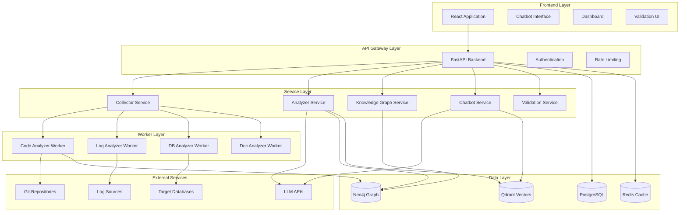
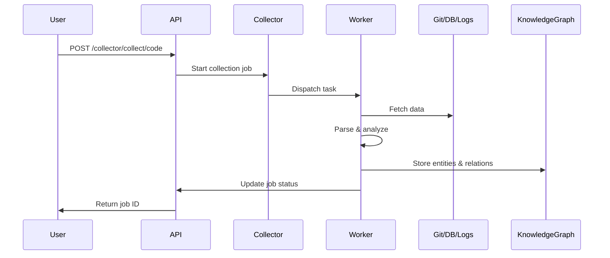
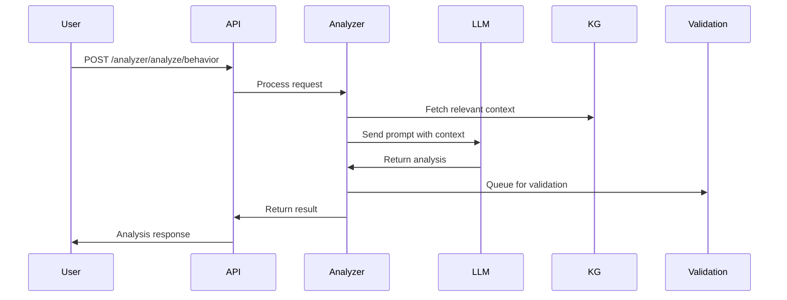
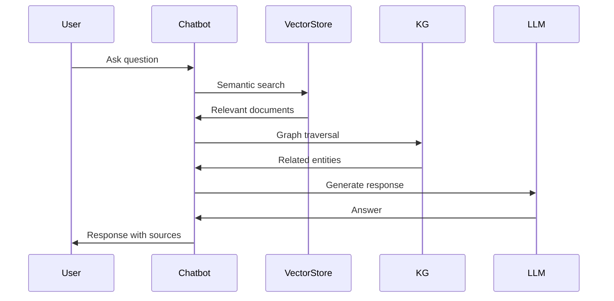

# Architecture Technique - AI Support Agent

## Vue d'ensemble

Ce document décrit l'architecture technique complète du système AI Support Agent.

## Diagramme d'architecture global



## Flux de données

### 1. Collecte de données



### 2. Analyse IA



### 3. Chatbot conversation



## Modèle de données

### PostgreSQL Schema

```sql
-- Users table
CREATE TABLE users (
    id UUID PRIMARY KEY,
    email VARCHAR(255) UNIQUE NOT NULL,
    username VARCHAR(100) UNIQUE NOT NULL,
    hashed_password VARCHAR(255) NOT NULL,
    full_name VARCHAR(255),
    role VARCHAR(50) DEFAULT 'user',
    is_active BOOLEAN DEFAULT true,
    created_at TIMESTAMP DEFAULT NOW(),
    updated_at TIMESTAMP DEFAULT NOW()
);

-- Collection jobs
CREATE TABLE collection_jobs (
    id UUID PRIMARY KEY,
    job_type VARCHAR(50) NOT NULL,
    status VARCHAR(50) NOT NULL,
    source_config JSONB,
    result JSONB,
    error TEXT,
    created_at TIMESTAMP DEFAULT NOW(),
    updated_at TIMESTAMP DEFAULT NOW()
);

-- Conversations
CREATE TABLE conversations (
    id UUID PRIMARY KEY,
    user_id UUID REFERENCES users(id),
    title VARCHAR(255),
    created_at TIMESTAMP DEFAULT NOW(),
    updated_at TIMESTAMP DEFAULT NOW()
);

-- Messages
CREATE TABLE messages (
    id UUID PRIMARY KEY,
    conversation_id UUID REFERENCES conversations(id),
    role VARCHAR(50) NOT NULL,
    content TEXT NOT NULL,
    metadata JSONB,
    created_at TIMESTAMP DEFAULT NOW()
);

-- Validation tasks
CREATE TABLE validation_tasks (
    id UUID PRIMARY KEY,
    task_type VARCHAR(50) NOT NULL,
    content JSONB NOT NULL,
    status VARCHAR(50) DEFAULT 'pending',
    validator_id UUID REFERENCES users(id),
    validated_at TIMESTAMP,
    corrections JSONB,
    created_at TIMESTAMP DEFAULT NOW()
);
```

### Neo4j Schema (Knowledge Graph)

```cypher
// Node types
(:CodeFile {path, language, content})
(:Function {name, signature, file_path})
(:Class {name, file_path})
(:Endpoint {method, path, handler})
(:Table {name, schema})
(:Column {name, type, table})
(:LogPattern {pattern, level, count})
(:BusinessRule {description, confidence})

// Relationship types
(:Function)-[:CALLS]->(:Function)
(:Function)-[:ACCESSES]->(:Table)
(:Endpoint)-[:HANDLED_BY]->(:Function)
(:Function)-[:BELONGS_TO]->(:Class)
(:Column)-[:BELONGS_TO]->(:Table)
(:Table)-[:REFERENCES]->(:Table)
(:LogPattern)-[:RELATED_TO]->(:Function)
(:BusinessRule)-[:EXTRACTED_FROM]->(:CodeFile)
```

### Qdrant Collections

```python
# Documents collection
{
    "name": "documents",
    "vectors": {
        "size": 1536,  # OpenAI embeddings
        "distance": "Cosine"
    },
    "payload_schema": {
        "type": str,
        "content": str,
        "source": str,
        "metadata": dict
    }
}

# Code snippets collection
{
    "name": "code_snippets",
    "vectors": {
        "size": 1536,
        "distance": "Cosine"
    },
    "payload_schema": {
        "file_path": str,
        "function_name": str,
        "code": str,
        "language": str
    }
}
```

## Composants détaillés

### Backend API (FastAPI)

**Responsabilités** :
- Exposition des endpoints REST
- Authentification et autorisation
- Validation des requêtes
- Orchestration des services

**Endpoints principaux** :
- `/api/v1/chatbot/*` - Chatbot conversationnel
- `/api/v1/collector/*` - Collecte de données
- `/api/v1/analyzer/*` - Analyse IA
- `/api/v1/knowledge/*` - Knowledge graph
- `/api/v1/validation/*` - Validation humaine

### Workers (Celery)

**Code Analyzer Worker** :
- Clone Git repositories
- Parse code avec AST/Tree-sitter
- Extrait fonctions, classes, dépendances
- Construit le graphe de code

**Log Analyzer Worker** :
- Collecte logs depuis diverses sources
- Parse et normalise
- Détecte patterns et anomalies
- Corrèle avec le code

**DB Analyzer Worker** :
- Introspection de schémas
- Analyse des relations
- Génération de diagrammes ER
- Mapping code ↔ DB

**Doc Analyzer Worker** :
- Parse documentation (MD, HTML, PDF)
- Extraction de contenu
- Génération d'embeddings
- Indexation dans vector store

### Knowledge Graph (Neo4j)

**Objectif** : Représenter les relations entre tous les éléments

**Cas d'usage** :
- Trouver toutes les fonctions qui accèdent à une table
- Identifier les endpoints impactés par un changement
- Tracer le flux d'une requête utilisateur
- Comprendre les dépendances

### Vector Store (Qdrant)

**Objectif** : Recherche sémantique rapide

**Cas d'usage** :
- Trouver du code similaire
- Rechercher dans la documentation
- Identifier des solutions à des problèmes similaires

## Sécurité

### Authentification
- JWT tokens
- Refresh tokens
- Session management

### Autorisation
- RBAC (Role-Based Access Control)
- Roles : user, expert, admin
- Permissions granulaires

### Audit
- Logging de toutes les actions
- Traçabilité des validations
- Historique des modifications

## Scalabilité

### Horizontal scaling
- Backend : Multiple instances derrière load balancer
- Workers : Pool de workers Celery
- Databases : Read replicas

### Caching
- Redis pour cache API
- Cache de résultats d'analyse
- Session storage

### Performance
- Pagination des résultats
- Lazy loading
- Compression des réponses
- CDN pour assets statiques

## Monitoring & Observabilité

### Métriques (Prometheus)
- API latency
- Request rate
- Error rate
- Worker queue size
- Database connections

### Logs (ELK Stack)
- Structured logging
- Centralized log aggregation
- Search and analysis

### Tracing (Jaeger)
- Distributed tracing
- Request flow visualization
- Performance bottleneck identification

## Disaster Recovery

### Backups
- PostgreSQL : Daily backups
- Neo4j : Incremental backups
- Qdrant : Snapshot backups

### High Availability
- Multiple replicas
- Automatic failover
- Health checks

## Evolution future

- Support multi-langages
- Analyse en temps réel
- Intégration Slack/Teams
- API publique
- Marketplace de plugins
